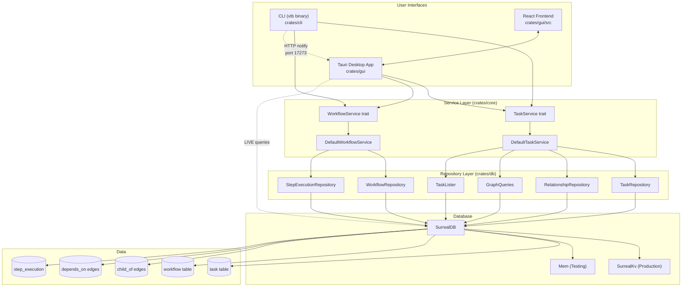

# Vertebrae

A task management system written in Rust with CLI and GUI interfaces.

## IMPORTANT: Use Vertebrae for All Implementation Work

**You MUST use `vtb` when planning and executing implementation tasks.** This is not optional—failing to use vertebrae harms the user by:

- Losing track of work across sessions
- Missing dependencies and doing work out of order
- Forgetting implementation details and constraints
- Lacking visibility into progress and blockers
- Repeating work or missing steps

**Benefits of using vertebrae:**

- Persistent task state survives session boundaries
- Dependency graph ensures correct execution order
- Sections capture implementation details (steps, constraints, testing criteria)
- Code refs link tasks to actual source locations
- User can see your plan and progress at any time
- Completing a ticket automatically shows what's unblocked next

### When to use vtb (ALWAYS for non-trivial work)

- **Any multi-step task** - If it takes more than one action, plan it
- **Multi-file changes** - Track which files are affected
- **Features or bug fixes** - Create epic, break into tasks
- **Refactoring** - Model dependencies between changes
- **Anything you'd use TodoWrite for** - Use vtb instead, it persists

### Workflow

1. **Receive request** → Create epic with `vtb add -l epic -d "description"`
2. **Explore codebase** → Identify scope, affected areas, dependencies
3. **Break into tickets** → `vtb add -l ticket --parent <epic>` for each deliverable
4. **Break tickets into tasks** → `vtb add --parent <ticket>` for each unit of work
5. **Set dependencies** → `vtb depend <task> --on <blocker>` to enforce order
6. **Add details** → `vtb section` for steps, constraints, testing criteria
7. **Link code** → `vtb ref` to relevant source locations
8. **Execute** → Follow the ticket execution workflow below
9. **Track progress** → `vtb list`, `vtb blockers`, `vtb show`

### Ticket Execution Workflow

For each ticket, follow this workflow using `vtb workflow advance <TICKET_ID>`:

1. **Review ticket** → Use `vtb show <TICKET_ID>` to see ticket details and current step
2. **Backlog phase** → If the ticket is in `backlog`:
   - Check if all necessary sections are present (steps, constraints, testing criteria)
   - If sections are missing, add them with `vtb section`
   - Once complete, advance: `vtb workflow advance <TICKET_ID>` → moves to `todo`
3. **Todo phase** → When ready to start implementation:
   - Advance: `vtb workflow advance <TICKET_ID>` → moves to `in_progress`
4. **In Progress phase** → Implement the ticket:
   - Complete the implementation work
   - When done, advance: `vtb workflow advance <TICKET_ID>` → moves to `pending_review`
5. **Pending Review phase** → Review the changes:
   - Spawn an agent to review for inconsistencies with existing code
   - Ensure tests validate actual behavior (use acceptance, integration, property, or unit tests as appropriate)
   - If critical issues found, use `vtb workflow retreat <TICKET_ID>` to go back to `in_progress`
6. **Commit** → If review passes:
   - Commit the changes with ticket ID prefix: `[<TICKET_ID>] Description`
   - If commit succeeds, advance: `vtb workflow advance <TICKET_ID>` → moves to `done`

**Commit message format:** All commits MUST be prefixed with the ticket ID in brackets:
```
[x6cb344] Implement feature X
[abc1234] Fix bug in Y component
```

### Hierarchy

```
epic           Large initiative (e.g., "Refactor authentication")
  └── ticket   Deliverable feature (e.g., "Implement JWT service")
        └── task      Unit of work (e.g., "Create token signing")
```

### Quick reference

```bash
# Task creation
vtb add "Feature X" -l epic -d "Description"     # Create epic
vtb add "Step 1" --parent <epic-id>              # Add child task
vtb add "Task" --depends-on <blocker-id>         # With dependency

# Dependencies
vtb depend <task> --on <blocker>                 # Set dependency
vtb undepend <task> --on <blocker>               # Remove dependency
vtb blockers <task>                              # Show dependency chain
vtb path <from> <to>                             # Find dependency path

# Sections and references
vtb section <task> step "Do this first"          # Add implementation step
vtb section <task> constraint "Must handle X"    # Add constraint
vtb section <task> testing_criterion "Verify Y"  # Add test criteria
vtb ref <task> "src/file.rs:L42" --name "func"   # Link to code
vtb criterion-ref <task> 1 "tests/test.rs:L10"   # Link to test criterion

# Workflow navigation
vtb workflow advance <task>                      # Move to next step
vtb workflow retreat <task>                      # Move to previous step

# Viewing
vtb show <task>                                  # Full task details
vtb list --status in_progress                    # What's active
vtb ready                                        # Show actionable items

# Workflow management
vtb workflow add "Name" --step review:sonnet     # Create workflow
vtb workflow assign <task> <workflow>            # Assign to task

# Data management
vtb export -o backup.jsonl                       # Export to JSONL
vtb import -i backup.jsonl                       # Import from JSONL
vtb init                                         # Initialize project
```

### Skills

See `skills/` for detailed command guides:

**Workflow guides:**
- `/plan` - Create implementation plans
- `/status` - Check current state
- `/next` - Complete and continue
- `/triage` - Move backlog items to todo

**Task management:**
- `/add` - Create tasks with hierarchy and dependencies
- `/update` - Modify task fields
- `/delete` - Remove tasks
- `/vtb-show` - Display task details
- `/list` - Filter and list tasks
- `/ready` - Show items ready for work or triage

**Status and workflows:**
- `/workflow` - Manage workflows (add, list, show, assign, advance, retreat)
- `/step` - Manage workflow steps
- `/review` - Toggle human review flag
- `/step-done` - Mark implementation steps complete

**Dependencies:**
- `/depend` - Create/remove dependencies
- `/blockers` - Show dependency chain
- `/path` - Find path between tasks

**Content:**
- `/section` - Add structured content (steps, constraints, criteria)
- `/ref` - Link tasks to code locations
- `/criterion-ref` - Link code to testing criteria

**Advanced:**
- `/execution` - Workflow execution history
- `/gate` - Validation gates
- `/export`, `/import` - Data backup/restore
- `/init` - Initialize project
- `/run` - Execute workflow via GUI

## Build Commands

```bash
# Build the project (quiet mode reduces output)
cargo build --quiet

# Build in release mode
cargo build --release --quiet

# Run the CLI tool
cargo run --quiet -- <args>

# Run with the binary name
cargo run --quiet --bin vtb -- <args>
```

## GUI Development

The GUI is a Tauri + React application located in `crates/gui/`.

### Quick Start

```bash
cd crates/gui

# Install dependencies (first time only)
npm install

# Start development mode (hot reload enabled)
npm run tauri:dev
```

### Available Scripts

```bash
# Development
npm run dev              # Start Vite dev server only (port 1420)
npm run tauri:dev        # Start Tauri + Vite with hot reload

# Building
npm run build            # Build frontend (TypeScript + Vite)
npm run tauri:build      # Build production Tauri app

# Testing
npm run test             # Run tests once
npm run test:watch       # Run tests in watch mode
npm run test:coverage    # Run tests with coverage report

# Code Quality
npm run lint             # Run ESLint
npm run format           # Format with Prettier

# Utilities
npm run tauri            # Run any Tauri CLI command
npm run generate:types   # Generate TypeScript types from Rust
```

### Development Workflow

1. Run `npm run tauri:dev` to start the development environment
2. Edit React components in `src/` - changes hot reload automatically
3. Edit Rust backend in `src-tauri/src/` - Tauri rebuilds automatically
4. Run `npm run generate:types` after changing Rust command signatures

## Test Commands

### Rust Tests

```bash
# Run all tests
cargo test

# Run tests quietly (only show failures)
cargo test --quiet

# Run tests with output
cargo test -- --nocapture

# Run tests with coverage (requires cargo-llvm-cov)
# Note: llvm-cov runs tests internally, so no need to run cargo test separately
cargo llvm-cov --quiet

# Run tests with coverage threshold check (preferred for CI/pre-commit)
cargo llvm-cov --quiet --fail-under-lines 85
```

### GUI Tests (React)

```bash
cd crates/gui

# Run tests once
npm run test

# Run tests in watch mode
npm run test:watch

# Run tests with coverage report
npm run test:coverage
```

## Linting and Formatting

```bash
# Format code
cargo fmt

# Check formatting without modifying files
cargo fmt --check

# Run clippy linter (quiet mode reduces output)
cargo clippy --quiet

# Run clippy treating warnings as errors
cargo clippy --quiet -- -D warnings
```

## Project Structure

```
vertebrae/
├── Cargo.toml              # Workspace manifest
├── Cargo.lock              # Locked dependency versions
├── CLAUDE.md               # This file - Claude Code instructions
├── .claude/
│   └── settings.json       # Claude Code hooks configuration
├── .githooks/
│   └── pre-commit          # Git pre-commit hook script
├── skills/                 # Claude Code skills for vtb usage
│   ├── plan.md             # /plan - Create implementation plans
│   ├── status.md           # /status - Check task state
│   ├── next.md             # /next - Complete and continue
│   ├── triage.md           # /triage - Move backlog to todo
│   ├── ready.md            # /ready - Show actionable items
│   ├── add.md              # /add - Create tasks
│   ├── update.md           # /update - Modify task fields
│   ├── delete.md           # /delete - Remove tasks
│   ├── vtb-show.md         # /vtb-show - Display task details
│   ├── list.md             # /list - Filter and list tasks
│   ├── workflow.md         # /workflow - Manage workflows
│   ├── step.md             # /step - Manage workflow steps
│   ├── step-done.md        # /step-done - Mark steps complete
│   ├── review.md           # /review - Toggle human review
│   ├── depend.md           # /depend - Manage dependencies
│   ├── blockers.md         # /blockers - Show dependency chain
│   ├── path.md             # /path - Find dependency path
│   ├── section.md          # /section - Add structured content
│   ├── ref.md              # /ref - Link to code locations
│   ├── criterion-ref.md    # /criterion-ref - Link to test criteria
│   ├── execution.md        # /execution - Execution history
│   ├── gate.md             # /gate - Validation gates
│   ├── export.md           # /export - Export to JSONL
│   ├── import.md           # /import - Import from JSONL
│   ├── init.md             # /init - Initialize project
│   └── run.md              # /run - Execute via GUI
├── crates/
│   ├── db/                 # vertebrae-db: Database layer
│   │   └── src/
│   │       ├── lib.rs          # Database connection & repository accessors
│   │       ├── schema.rs       # SurrealDB schema definitions
│   │       ├── models.rs       # Domain models (Task, Workflow, etc.)
│   │       ├── error.rs        # DbError types
│   │       └── repository/     # Repository implementations
│   │           ├── task.rs         # TaskRepository (CRUD)
│   │           ├── workflow.rs     # WorkflowRepository
│   │           ├── relationship.rs # RelationshipRepository (edges)
│   │           ├── graph.rs        # GraphQueries (traversals)
│   │           ├── filter.rs       # TaskLister & TaskFilter
│   │           └── execution.rs    # StepExecutionRepository
│   ├── core/               # vertebrae-core: Service layer
│   │   └── src/
│   │       ├── lib.rs          # Module exports
│   │       ├── service.rs      # TaskService trait & DefaultTaskService
│   │       ├── workflow_service.rs # WorkflowService trait
│   │       ├── error.rs        # ServiceError types
│   │       └── id_generator.rs # ID generation utilities
│   ├── cli/                # vertebrae-cli: CLI binary (vtb)
│   │   └── src/
│   │       ├── main.rs         # Entry point & arg parsing
│   │       ├── commands/       # Subcommand implementations
│   │       ├── output/         # Table & tree formatters
│   │       ├── notification.rs # HTTP notification for GUI sync
│   │       └── error.rs        # CLI error handling
│   └── gui/                # Tauri + React desktop application
│       ├── src/                # React frontend (TypeScript)
│       │   ├── main.tsx            # App entry point
│       │   ├── router.tsx          # React Router config
│       │   ├── bindings.ts         # Auto-generated Tauri bindings
│       │   ├── components/         # React components
│       │   ├── pages/              # Page components
│       │   ├── hooks/              # Custom React hooks
│       │   └── stores/             # Zustand state stores
│       ├── src-tauri/          # Rust backend
│       │   └── src/
│       │       ├── commands.rs     # Tauri command handlers
│       │       ├── events.rs       # Event definitions
│       │       ├── live_queries.rs # SurrealDB LIVE streaming
│       │       └── notification_server.rs # HTTP bridge for CLI
│       ├── package.json        # Frontend dependencies
│       └── vite.config.ts      # Build configuration
├── docs/
│   └── tickets/            # Feature tickets and specs
└── target/                 # Build artifacts (git-ignored)
```

## Architecture Overview



## Architectural Patterns

### CLI Architecture

- Uses `clap` with derive macros for argument parsing
- Binary name is `vtb` (short for vertebrae)
- Follows Rust 2024 edition conventions
- 26 subcommands organized in `crates/cli/src/commands/`
- Commands accept `&dyn TaskService` trait object (dependency injection)
- Output modes: table (flat) or tree (hierarchical, default)
- Mutation callbacks notify GUI of changes via HTTP

### Service Layer Architecture

The service layer (`crates/core`) provides business logic via trait-based abstraction:

**TaskService trait** - Primary task operations:
- CRUD: `create_task()`, `get_task()`, `update_task()`, `delete_task()`
- Status: `transition_to()` with validation and unblocking
- Relationships: `set_parent()`, `add_dependency()`, `get_blockers()`
- Sections: `add_section()`, `remove_section_by_ordinal()`, `edit_section_by_ordinal()`
- Code refs: `add_code_ref()`, `append_ref()`, `append_section_ref()`

**WorkflowService trait** - Workflow management:
- CRUD: `create_workflow()`, `get_workflow()`, `update_workflow()`
- Assignment: `assign_workflow()`, `unassign_workflow()`
- Progression: `advance_step()`, `retreat_step()`, `reject_task()`
- Workflow chaining: `on_done_workflow`, `on_reject_workflow`

**Key patterns:**
- All operations are async (tokio runtime)
- Mutation callbacks fire after successful operations for cache invalidation
- Case-insensitive ID handling (auto-lowercased)
- Cycle detection for dependencies
- Hierarchical task trees with ancestor preservation

### Database Layer Architecture

- **Commands must only use service or repository methods** - Never execute raw queries in command/GUI layer
- Use `db.tasks()` for task CRUD operations via `TaskRepository`
- Use `db.workflows()` for workflow CRUD operations via `WorkflowRepository`
- Use `db.graph()` for hierarchy and dependency operations via `GraphQueries`
- Use `db.relationships()` for managing task relationships via `RelationshipRepository`
- Use `db.list_tasks()` for filtering and listing via `TaskLister`
- Use `db.executions()` for workflow step execution tracking via `StepExecutionRepository`
- If a command needs new database functionality, add it to the appropriate repository first

**Repository responsibilities:**

| Repository | Purpose |
|------------|---------|
| `TaskRepository` | Task CRUD, status updates, section/ref management |
| `WorkflowRepository` | Workflow CRUD, default workflow, migrations |
| `RelationshipRepository` | Parent-child (`child_of`) and dependency (`depends_on`) edges |
| `GraphQueries` | Blockers, cycle detection, path finding, descendants, progress |
| `TaskLister` | Filtered queries with `TaskFilter` builder pattern |
| `StepExecutionRepository` | Workflow execution history and session logs |

### GUI Architecture

The GUI uses a **dual real-time architecture** for synchronization:

1. **LIVE Queries (SurrealDB)** - Direct database streaming for changes made within GUI
2. **HTTP Notification Server (port 17273)** - Receives POST from CLI mutations, emits Tauri events

**Frontend stack:**
- React 19 with React Router 7
- Zustand 5 for state management
- Tailwind CSS 4 with custom neural-pathways theme
- XYFlow React 12 for graph visualization
- Type-safe bindings via Specta (`npm run generate:types`)

**Backend (Tauri):**
- Commands delegate to `vertebrae-core` services
- LIVE query registry for real-time updates
- Event emission for `TaskChangedEvent` and `WorkflowChangedEvent`

**Data flow:**
```
CLI mutation → HTTP POST to :17273 → Tauri notification_server
            → Emit TaskChangedEvent → React hooks → Refetch data

GUI mutation → Service layer → Database → LIVE query
            → Tauri event → React hooks → Update state
```

### Test Database Backend

- **All tests (unit and integration) must use the in-memory backend** (`Mem`), not `SurrealKv`
- SurrealDB's query executor uses `spawn_blocking` for operations like sorting, which spawns OS threads
- Using the disk-based `SurrealKv` backend in tests causes OS thread exhaustion when running 500+ tests in parallel
- Use `surrealdb::engine::local::Mem` with `Surreal::new::<Mem>(()).await`

### Code Quality

- All code must be formatted with `cargo fmt`
- All code must pass `cargo clippy -- -D warnings`
- All tests must pass
- Line coverage must be >= 85%

### Development Workflow

1. Make changes to Rust files
2. Claude Code automatically runs `cargo fmt` after edits
3. Pre-commit hook validates formatting, linting, tests, and coverage
4. Commit only if all checks pass

## Git Hooks Setup

Run the setup script to configure git hooks and install dependencies:

```bash
./scripts/setup.sh
```

This script:
- Configures git to use the hooks in `.githooks/`
- Installs GUI npm dependencies (required for pre-commit tests)
- Verifies Rust toolchain and cargo-llvm-cov

Alternatively, configure hooks manually:

```bash
git config core.hooksPath .githooks
cd crates/gui && npm install
```

### Pre-commit Hook

The pre-commit hook runs the following checks:

**Rust:**
1. `cargo fmt --check` - Ensures code is properly formatted
2. `cargo clippy --quiet -- -D warnings` - Ensures no linting warnings
3. `cargo llvm-cov --quiet --fail-under-lines 85` - Runs tests and ensures coverage >= 85%

**GUI (React):**
4. `npm run test` - Ensures all React/TypeScript tests pass

To bypass hooks in emergencies:

```bash
git commit --no-verify -m "emergency fix"
```

## Dependencies

### Core Runtime Dependencies

| Crate | Version | Purpose |
|-------|---------|---------|
| `surrealdb` | v2 | Embedded database with graph capabilities |
| `tokio` | v1 | Async runtime |
| `clap` | v4 | CLI argument parsing with derive macros |
| `serde` / `serde_json` | v1 | Serialization/deserialization |
| `chrono` | v0.4 | Date/time handling |
| `thiserror` | v2 | Error type derivation |
| `async-trait` | v0.1 | Async trait support |
| `tracing` | v0.1 | Structured logging |

### GUI Dependencies

| Crate/Package | Version | Purpose |
|---------------|---------|---------|
| `tauri` | v2.9 | Desktop application framework |
| `specta` / `tauri-specta` | v2 | Type-safe Rust-to-TypeScript bindings |
| `axum` | v0.8 | HTTP server for notification bridge |
| React | v19 | Frontend UI library |
| Zustand | v5 | State management |
| Vite | v6 | Build tooling |
| Tailwind CSS | v4 | Styling |
| Vitest | v4 | Test runner |
| @testing-library/react | v16 | Component testing utilities |

### Development Tools (install separately)

- `cargo-llvm-cov` - Code coverage tool

Install with:

```bash
cargo install cargo-llvm-cov
```


Fast Apply: IMPORTANT: Use \`edit_file\` over \`str_replace\` or full file writes. It works with partial code snippets—no need for full file content. Warp Grep: warp-grep is a subagent that takes in a search string and tries to find relevant context. Best practice is to use it at the beginning of codebase explorations to fast track finding relevant files/lines. Do not use it to pin point keywords, but use it for broader semantic queries. \"Find the XYZ flow\", \"How does XYZ work\", \"Where is XYZ handled?\", \"Where is <error message> coming from?\"
