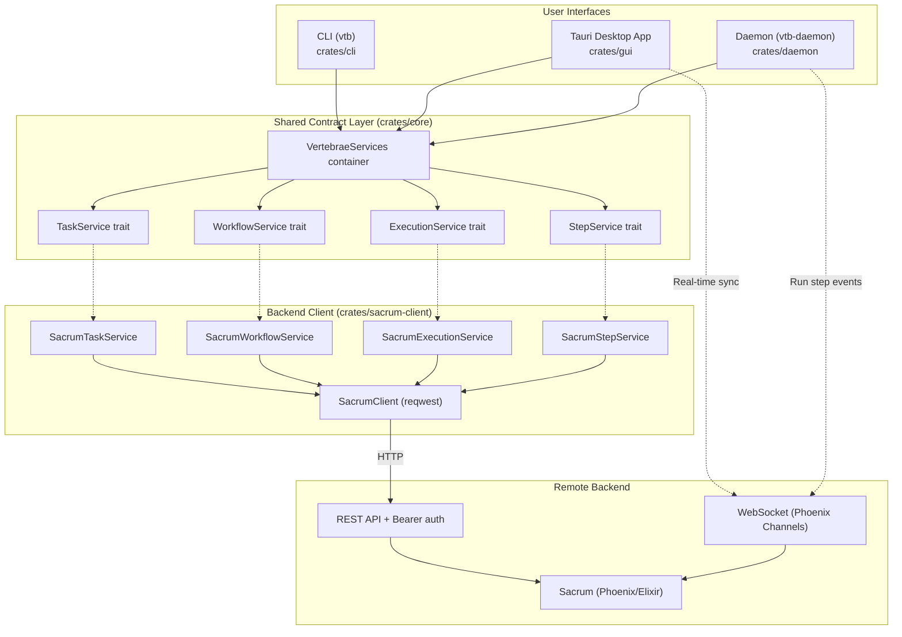

# Architecture

Vertebrae is a Rust workspace with five crates, each with a distinct role. All crates share a trait-based service abstraction backed by the Sacrum REST API.

> For the full system-level view including the Sacrum backend, daemon execution model, and real-time architecture, see [System Overview](system-overview.md).

## Crate Map

```
vertebrae/
├── crates/core/           # Shared contracts: traits + domain models
├── crates/sacrum-client/  # HTTP client implementing the service traits
├── crates/cli/            # CLI binary (vtb)
├── crates/daemon/         # Background step executor (vtb-daemon)
└── crates/gui/            # Tauri + React desktop app
```



## Core (`crates/core`)

The shared contract layer. Contains **no backend implementation** — only traits, domain models, and error types.

### Service Traits

| Trait | Purpose |
|-------|---------|
| `TaskService` | Task CRUD, relationships, sections, code refs, tree queries |
| `WorkflowService` | Workflow CRUD, assignment, step progression, chaining |
| `ExecutionService` | Step execution history and session logs |
| `StepService` | First-class workflow step CRUD |

### Service Container

`VertebraeServices` bundles all four service traits:

```rust
pub struct VertebraeServices {
    pub tasks: Arc<dyn TaskService>,
    pub workflows: Arc<dyn WorkflowService>,
    pub executions: Arc<dyn ExecutionService>,
    pub steps: Arc<dyn StepService>,
}
```

CLI, GUI, and daemon all construct it via a `from_sacrum()` factory at startup. Commands and handlers only depend on the traits — never on transport details.

### Domain Models

Key types: `Task`, `Workflow`, `Step`, `Section`, `CodeRef`, `StepExecution`, `SessionLog`, `TaskFilter`, `Priority`, `Level`, `StepType`

Steps carry:
- `step_type: StepType` — `Execute` (default), `Evaluate`, or `Route`
- `output_schema: Option<Value>` — JSON Schema for structured output enforcement
- `agent_config: AgentConfig` — LLM configuration (model, budget, tools, permissions, json_schema)

DTOs: `CreateTaskOptions`, `UpdateTaskOptions`, `CreateWorkflowOptions`, `StepUpdate`, etc.

Error types: `ServiceError`, `ServiceResult`

## Sacrum Client (`crates/sacrum-client`)

Concrete implementations of all service traits via HTTP REST.

### Configuration

- `.vtb/config.toml` holds `url` (default `http://localhost:4000`) and `project_id`
- `SACRUM_API_TOKEN` env var provides bearer token
- `SacrumConfig::load()` reads both sources

See [SACRUM_CONFIG.md](SACRUM_CONFIG.md) for full reference.

### HTTP Client

`SacrumClient` wraps `reqwest::Client` with bearer auth:

- Standard REST methods: `get()`, `post()`, `put()`, `delete()`
- All responses wrapped in `DataEnvelope { data: T }` — auto-unwrapped
- Paths scoped to project: `/projects/{project_id}/tasks`, `/projects/{project_id}/workflows`, etc.

### Service Implementations

| Struct | Implements | Maps to |
|--------|-----------|---------|
| `SacrumTaskService` | `TaskService` | Task REST endpoints |
| `SacrumWorkflowService` | `WorkflowService` | Workflow REST endpoints |
| `SacrumExecutionService` | `ExecutionService` | Execution REST endpoints |
| `SacrumStepService` | `StepService` | Step REST endpoints |

## CLI (`crates/cli`)

Binary name: `vtb`

- Uses `clap` with derive macros for argument parsing
- Follows Rust 2024 edition conventions
- 30+ subcommands organized in `crates/cli/src/commands/`
- Output modes: tree (hierarchical, default), table (flat), JSON (`--json`)
- At startup: loads Sacrum config, creates `SacrumClient`, builds `VertebraeServices`

See [vtb Guide](vtb-guide.md) for full CLI reference.

## Daemon (`crates/daemon`)

Binary name: `vtb-daemon`

Actor-based system using Ractor:

```
DaemonSupervisor
  └── ProjectSupervisor (one per connected project)
        └── StepExecutor (one per active step execution)
```

- Connects to Sacrum via Phoenix WebSocket (`client_type: "daemon"`)
- Receives `run_step` events with prompt + agent config + output schema
- Spawns `claude -p "<prompt>" --output-format stream-json` subprocesses
- When a step has an `output_schema`, passes it as `--json-schema` to enforce structured output
- Step-level `output_schema` takes precedence over `agent_config.json_schema`
- Streams stdout as `SessionLog` records to Sacrum
- Reports completion/failure with token counts and cost
- Handles step types: `execute` (run prompt), `evaluate` (assess output for routing), `route` (branch logic)
- Runs as macOS launchd service (managed via `vtb daemon install/uninstall/status`)

## GUI (`crates/gui`)

Tauri 2 + React 19 desktop application.

See [GUI Development](gui-development.md) for dev setup and frontend details.

- **~34 Tauri commands** wrapping `VertebraeServices`
- **WebSocket real-time sync** via Phoenix channels
- **PTY manager** for embedded terminal sessions
- **Workflow runner** for automated step execution from the GUI
