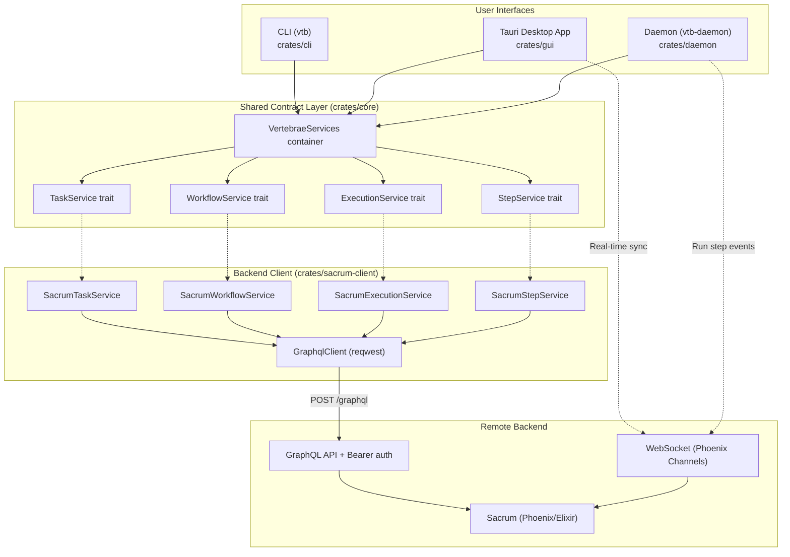

# Architecture

Vertebrae is a Rust workspace with interface, daemon, and test crates. The production crates share a trait-based service abstraction backed by the Sacrum GraphQL API and Phoenix channels.

> For the full system-level view including the Sacrum backend, daemon execution model, and real-time architecture, see [System Overview](system-overview.md).

## Crate Map

```
vertebrae/
├── crates/core/           # Shared contracts: traits + domain models
├── crates/sacrum-client/  # HTTP client implementing the service traits
├── crates/cli/            # CLI binary (vtb)
├── crates/daemon/         # Background step executor (vtb-daemon)
└── crates/gui/            # Tauri + React desktop app
```



## Core (`crates/core`)

The shared contract layer. Contains **no backend implementation** — only traits, domain models, and error types.

### Service Traits

| Trait | Purpose |
|-------|---------|
| `TaskService` | Task CRUD, relationships, sections, code refs, tree queries |
| `WorkflowService` | Workflow CRUD, assignment, step progression, chaining |
| `ExecutionService` | Step execution history and session logs |
| `StepService` | First-class workflow step CRUD |

### Service Container

`VertebraeServices` bundles all four service traits:

```rust
pub struct VertebraeServices {
    pub tasks: Arc<dyn TaskService>,
    pub workflows: Arc<dyn WorkflowService>,
    pub executions: Arc<dyn ExecutionService>,
    pub steps: Arc<dyn StepService>,
}
```

CLI, GUI, and daemon all construct it via a `from_sacrum()` factory at startup. Commands and handlers only depend on the traits — never on transport details.

### Domain Models

Key types: `Task`, `Workflow`, `Step`, `Section`, `CodeRef`, `StepExecution`, `SessionLog`, `TaskFilter`, `Priority`, `Level`, `StepType`

Steps carry:
- `step_type: StepType` — `Execute` (default), `Evaluate`, or `Route`
- `output_schema: Option<Value>` — JSON Schema for structured output enforcement
- `agent_config: AgentConfig` — LLM configuration (model, budget, tools, permissions, json_schema)

DTOs: `CreateTaskOptions`, `UpdateTaskOptions`, `CreateWorkflowOptions`, `StepUpdate`, etc.

Error types: `ServiceError`, `ServiceResult`

## Sacrum Client (`crates/sacrum-client`)

Concrete implementations of all service traits via GraphQL.

### Configuration

- `~/.config/vertebrae/config.toml` holds global Sacrum settings and project registrations
- `VTB_URL`, `VTB_TOKEN`, and `VTB_PROJECT_ID` can override CLI configuration
- `SacrumConfig::load()` resolves the CLI project by matching the current git root against configured project paths
- `SacrumConfig::load_for_project()` resolves a GUI-selected project by slug

See [SACRUM_CONFIG.md](SACRUM_CONFIG.md) for full reference.

### HTTP Client

`GraphqlClient` wraps `reqwest::Client` with bearer auth:

- Posts all operations to `{base_url}/graphql`
- Sends `Authorization: Bearer <token>` and `Content-Type: application/json`
- Extracts typed values from `data.<field>`
- Reports GraphQL errors separately from HTTP errors

### Service Implementations

| Struct | Implements | Maps to |
|--------|------------|---------|
| `SacrumTaskService` | `TaskService` | Task GraphQL queries and mutations |
| `SacrumWorkflowService` | `WorkflowService` | Workflow GraphQL queries and mutations |
| `SacrumExecutionService` | `ExecutionService` | Execution GraphQL queries and mutations |
| `SacrumStepService` | `StepService` | Step GraphQL queries and mutations |

## CLI (`crates/cli`)

Binary name: `vtb`

- Uses `clap` with derive macros for argument parsing
- Follows Rust 2024 edition conventions
- 30+ subcommands organized in `crates/cli/src/commands/`
- Output modes: tree (hierarchical, default), table (flat), JSON (`--json`)
- At startup: loads Sacrum config, creates `SacrumClient`, builds `VertebraeServices`

See [vtb Guide](vtb-guide.md) for the CLI guide entrypoint.

## Daemon (`crates/daemon`)

Binary name: `vtb-daemon`

Actor-based system using Ractor:

```
DaemonSupervisor
  └── ProjectSupervisor (one per connected project)
        └── StepExecutor (one per active step execution)
```

- Connects to Sacrum via Phoenix WebSocket (`client_type: "daemon"`)
- Receives `run_step` events with prompt + agent config + output schema
- Resolves the step's `agent_config.provider` to a built-in harness:
  `anthropic` (default) → `claude -p "<prompt>" --output-format stream-json`,
  `openai` → `codex exec --json "<prompt>"`. See
  [vtb Guide — Provider Selection](vtb-guide/steps.md#provider-selection-anthropic--openai).
- When a step has an `output_schema`, passes it as `--json-schema` (Claude) or
  `--output-schema <path>` (Codex) to enforce structured output
- Step-level `output_schema` takes precedence over `agent_config.json_schema`
- Streams stdout as `SessionLog` records to Sacrum
- Reports completion/failure with token counts, cost, and the actual
  provider/model used
- Handles step types: `execute` (run prompt), `evaluate` (assess output for routing), `route` (branch logic)
- Runs as macOS launchd service (managed via `vtb daemon install/uninstall/status`)

## GUI (`crates/gui`)

Tauri 2 + React 19 desktop application.

See [GUI Development](gui-development.md) for dev setup and frontend details.

- **~34 Tauri commands** wrapping `VertebraeServices`
- **WebSocket real-time sync** via Phoenix channels
- **Claude session manager** for JSONL chat sessions
- Workflow execution commands delegate to Sacrum; daemon clients pick up execution events
