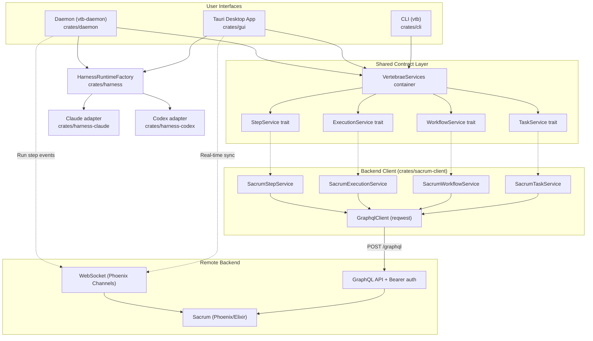

# Architecture

Vertebrae is a Rust workspace with interface, daemon, and test crates. The production crates share a trait-based service abstraction backed by the Sacrum GraphQL API and Phoenix channels.

> For the full system-level view including the Sacrum backend, daemon execution model, and real-time architecture, see [System Overview](system-overview.md).

## Crate Map

```
vertebrae/
├── crates/core/           # Shared contracts: traits + domain models
├── crates/harness/        # Provider selection/composition for HarnessRuntime
├── crates/harness-core/   # V1 runtime, event, and replay contracts
├── crates/harness-claude/ # Claude streaming CLI adapter
├── crates/harness-codex/  # Codex App Server streaming adapter
├── crates/sacrum-client/  # HTTP client implementing the service traits
├── crates/cli/            # CLI binary (vtb)
├── crates/daemon/         # Background step executor (vtb-daemon)
└── crates/gui/            # Tauri + React desktop app
```



## Core (`crates/core`)

The shared contract layer. Contains **no backend implementation** — only traits, domain models, and error types.

### Service Traits

| Trait | Purpose |
|-------|---------|
| `TaskService` | Task CRUD, relationships, sections, code refs, tree queries |
| `WorkflowService` | Workflow CRUD, assignment, step progression, chaining |
| `ExecutionService` | Step execution history and session logs |
| `StepService` | First-class workflow step CRUD |

### Service Container

`VertebraeServices` bundles all four service traits:

```rust
pub struct VertebraeServices {
    pub tasks: Arc<dyn TaskService>,
    pub workflows: Arc<dyn WorkflowService>,
    pub executions: Arc<dyn ExecutionService>,
    pub steps: Arc<dyn StepService>,
}
```

CLI, GUI, and daemon all construct it via a `from_sacrum()` factory at startup. Commands and handlers only depend on the traits — never on transport details.

### Domain Models

Key types: `Task`, `Workflow`, `Step`, `Section`, `CodeRef`, `StepExecution`, `SessionLog`, `TaskFilter`, `Priority`, `Level`, `StepType`

Steps carry:
- `step_type: StepType` — `Execute` (default), `Evaluate`, or `Route`
- `output_schema: Option<Value>` — JSON Schema for structured output enforcement
- `agent_config: AgentConfig` — LLM configuration (model, budget, tools, permissions, json_schema)

DTOs: `CreateTaskOptions`, `UpdateTaskOptions`, `CreateWorkflowOptions`, `StepUpdate`, etc.

Error types: `ServiceError`, `ServiceResult`

## Harness Crates

The harness crates are the only place provider wire protocols live. Every
surface — GUI local chat and daemon step execution — talks to them through one
provider-neutral contract, so there is a single normalized event stream for
both live delivery and `format=harness` `SessionLog` replay.

### Crate ownership

| Crate | Owns | Must not contain |
|-------|------|------------------|
| `crates/harness-core` | The V1 contract: `HarnessRuntime`, `SessionHandle`/`TurnHandle`, `HarnessEventV1` + drafts, `EventSequencer`, `EventSink`, `ControlSink`, capabilities, and the canonical projection | Provider wire types, surface orchestration |
| `crates/harness-claude` | Claude Code discovery, launch policy, live stream-json decoding, control responses, process lifetime | GUI, daemon, actor, persistence, or provider-settings code |
| `crates/harness-codex` | Codex App Server launch/readiness, WebSocket JSON-RPC, model catalog, turn and control mapping | GUI, daemon, actor, persistence, or provider-settings code |
| `crates/harness` | Provider **selection** only: `HarnessRuntimeFactory` maps `AgentConfig.provider` to an adapter and normalizes `RequestConfig` | Wire protocols, event decoding |

Only `crates/harness` depends on the adapter crates. Surfaces depend on
`vertebrae-harness` (construction) and `vertebrae-harness-core` (contract), and
never on `vertebrae-harness-claude` or `vertebrae-harness-codex` directly —
that is what keeps provider knowledge out of the daemon and the GUI.

```
crates/daemon ──┐                  ┌── crates/harness-claude
                ├── crates/harness ┤
crates/gui ─────┘        │         └── crates/harness-codex
                         │                     │
                         └──── crates/harness-core ────┘
```

### Event flow

Adapters emit `HarnessEventDraftV1`; `EventSequencer` assigns per-stream
sequence numbers and produces `HarnessEventV1`. That single stream feeds:

- **Live delivery** — the GUI's local-chat event sink translates
  `HarnessEventV1` into local-chat Tauri events
- **Persistence** — the daemon's `SessionLogEventSink` writes serialized
  `HarnessEventV1` payloads as `format=harness` `SessionLog` records
- **Replay** — the GUI projects those same `format=harness` records through the
  canonical projection, so replayed traces match what was shown live

Raw `anthropic`/`openai` `SessionLog` rows written before the harness cutover
are still readable through isolated compatibility readers in the GUI. Provider
transcript-file (JSONL) discovery and replay are **not** supported and must not
be reintroduced.

### Adding a provider

1. Add the variant to `Provider` in `crates/core/src/model_catalog.rs` and its
   models to the catalog.
2. Create `crates/harness-<provider>` implementing `HarnessRuntime` from
   `harness-core`. Emit `HarnessEventDraftV1` — never a provider-shaped event —
   and map provider approvals onto `ControlRequestEnvelope`.
3. Add the crate as a dependency of `crates/harness` only, and extend
   `HarnessRuntimeFactory::create` plus `normalized_request_config` with the
   new match arm.
4. Surfaces need no provider-specific code: the daemon persists the normalized
   events unchanged, and the GUI renders them through the existing projection.

## Sacrum Client (`crates/sacrum-client`)

Concrete implementations of all service traits via GraphQL.

### Configuration

- `~/.config/vertebrae/config.toml` holds global Sacrum settings and project registrations
- `VTB_URL`, `VTB_TOKEN`, and `VTB_PROJECT_ID` can override CLI configuration
- `SacrumConfig::load()` resolves the CLI project by matching the current git root against configured project paths
- `SacrumConfig::load_for_project()` resolves a GUI-selected project by slug

See [SACRUM_CONFIG.md](SACRUM_CONFIG.md) for full reference.

### HTTP Client

`GraphqlClient` wraps `reqwest::Client` with bearer auth:

- Posts all operations to `{base_url}/graphql`
- Sends `Authorization: Bearer <token>` and `Content-Type: application/json`
- Extracts typed values from `data.<field>`
- Reports GraphQL errors separately from HTTP errors

### Service Implementations

| Struct | Implements | Maps to |
|--------|------------|---------|
| `SacrumTaskService` | `TaskService` | Task GraphQL queries and mutations |
| `SacrumWorkflowService` | `WorkflowService` | Workflow GraphQL queries and mutations |
| `SacrumExecutionService` | `ExecutionService` | Execution GraphQL queries and mutations |
| `SacrumStepService` | `StepService` | Step GraphQL queries and mutations |

## CLI (`crates/cli`)

Binary name: `vtb`

- Uses `clap` with derive macros for argument parsing
- Follows Rust 2024 edition conventions
- 30+ subcommands organized in `crates/cli/src/commands/`
- Output modes: tree (hierarchical, default), table (flat), JSON (`--json`)
- At startup: loads Sacrum config, creates `SacrumClient`, builds `VertebraeServices`

See [vtb Guide](vtb-guide.md) for the CLI guide entrypoint.

## Daemon (`crates/daemon`)

Binary name: `vtb-daemon`

Actor-based system using Ractor:

```
DaemonSupervisor
  └── ProjectSupervisor (one per connected project)
        └── StepExecutor (one per active step execution)
```

- Connects to Sacrum via Phoenix WebSocket (`client_type: "daemon"`)
- Receives `run_step` events with prompt + agent config + output schema
- Passes `AgentConfig` and portable request options to the shared
  `HarnessRuntimeFactory`, which resolves the step's provider to a built-in
  harness: `anthropic` (default) → the Claude streaming harness,
  `openai` → the Codex App Server streaming harness. See
  [vtb Guide — Provider Selection](vtb-guide/steps.md#provider-selection-anthropic--openai).
- When a step has an `output_schema`, passes it through the provider-neutral
  harness request to enforce structured output
- Step-level `output_schema` takes precedence over `agent_config.json_schema`
- Persists the harness's normalized `HarnessEventV1` stream to Sacrum as
  `format=harness` `SessionLog` records via `SessionLogEventSink`
- Reports completion/failure with token counts, cost, and the actual
  provider/model used, derived from the normalized usage and outcome events
- Handles step types: `execute` (run prompt), `evaluate` (assess output for routing), `route` (branch logic)
- Runs as a macOS launchd or Linux systemd user service installed by the GUI onboarding flow

At daemon boot, shell PATH, provider executable discovery, managed skill roots,
and Claude installed-skill compatibility are captured in one immutable,
process-local capability snapshot shared by all project and step actors. The
snapshot is observational: a missing provider remains present with its
diagnostic, and the requested step retains the existing provider error path.
Installing or updating Claude Code, providers, or skills while the daemon is
running takes effect after restart.

## GUI (`crates/gui`)

Tauri 2 + React 19 desktop application.

See [GUI Development](gui-development.md) for dev setup and frontend details.

- **~34 Tauri commands** wrapping `VertebraeServices`
- **WebSocket real-time sync** via Phoenix channels
- **Provider-neutral local chat harnesses** for Claude and Codex sessions,
  built through the shared `HarnessRuntimeFactory` (see [Harness Crates](#harness-crates))
- Workflow execution commands delegate to Sacrum; daemon clients pick up execution events
